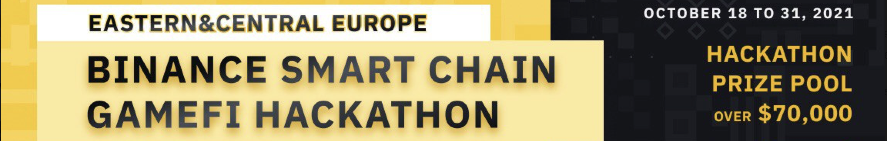
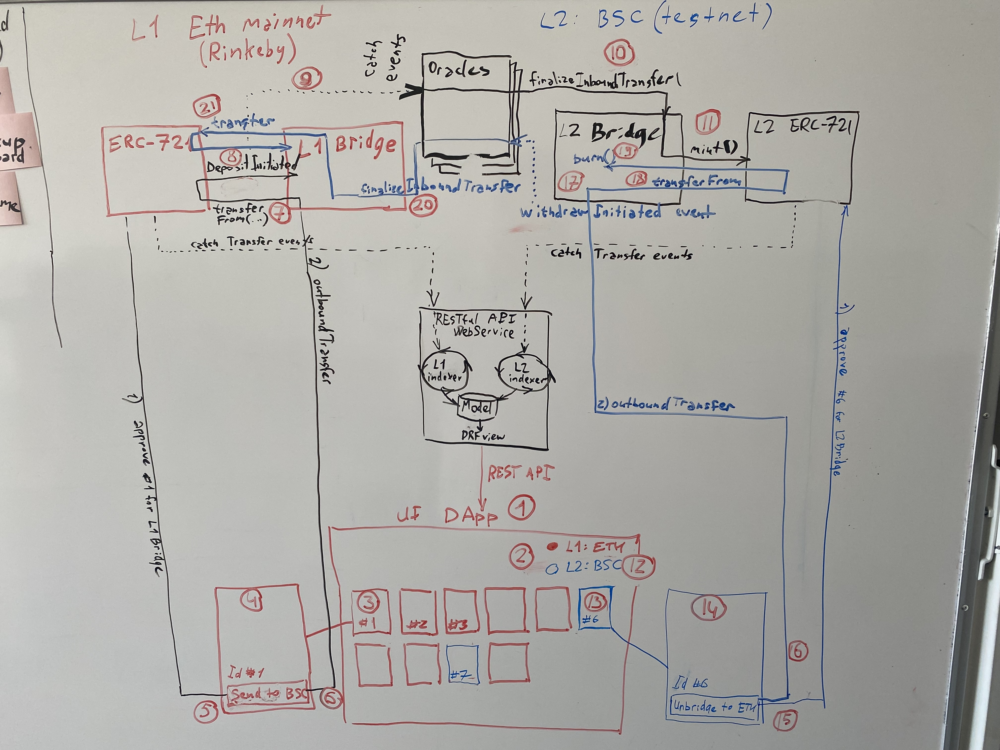

# OnBridge NFT cross-chain Gateway

## Cross-chain ERC-721/1155 bridge for advanced GameFi mechanics

Status: Early prototype. Was initially built diring the [BSC GameFi Hackathon](https://hackerlink.io/grant/REE/1)

Support us [here](https://hackerlink.io/buidl/1606?roundProj=1184)

# Releases and Changelog

* `v0.1.0-pre-alpha-bsc` implement basic flow of one-way bridging from Ethereum mainnet (Rinkeby) to BSC (testnet) [Demo](https://youtu.be/pQbSB7JWahE)
* `v0.1.1-pre-alpha-bsc-battleverse` bidirectional bridging from Ethereum mainnet (Rinkeby) to BSC (testnet) and back. Cross-chain play-and-earn with Battleverse [Demo](https://youtu.be/R3vM0xEpgGE)

# Architecture

One day we'll structure this into beautiful gitbook, but currently the design is following (photo from the hackathon's whiteboard)

# Code repositories

* [Root repository](https://github.com/Onbridge-io/onbridge)
* [Bridge DApp](https://github.com/Onbridge-io/onbridge_app)
* [Indexing service and API endpoint](https://github.com/Onbridge-io/onbridge_api)
* [Bridge DApp](https://github.com/Onbridge-io/onbridge_app)
* Ethereum/EVM [contracts](https://github.com/Onbridge-io/onbridge_contracts)
